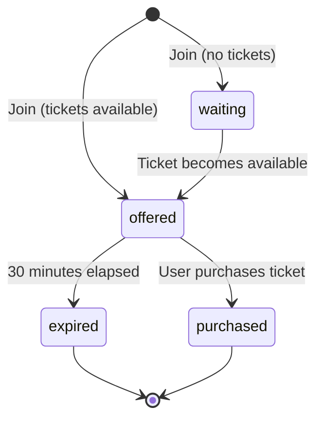

## Overview

The Waiting List API provides endpoints for managing event waiting lists, queue positions, and time-limited ticket offers. When tickets sell out, users can join a waiting list and receive automatic offers when tickets become available.

## Key Features

- **Automatic Queue Management**: Users are automatically offered tickets when spots become available
- **Time-Limited Offers**: Ticket offers expire after 30 minutes if not purchased
- **Rate Limiting**: Prevents abuse with 3 joins per 30 minutes per user
- **Real-Time Position Tracking**: Query current queue position at any time

## Waiting List Status Flow

## Status Values

<ParamField body="status" type="enum" required>
  Current status of the waiting list entry
  
  - `waiting` - User is in queue waiting for a ticket
  - `offered` - User has an active ticket offer (30 minute expiration)
  - `purchased` - User successfully purchased the ticket
  - `expired` - Ticket offer expired without purchase
</ParamField>

## Rate Limiting

To prevent abuse, the `joinWaitingList` mutation enforces rate limits:

- **Rate**: 3 joins per user
- **Window**: 30 minutes (fixed window)
- **Scope**: Per user ID across all events

When rate limit is exceeded, the API returns an error with retry-after time in minutes.

## Offer Expiration

Ticket offers automatically expire after **30 minutes** (`DURATIONS.TICKET_OFFER`). This is the minimum duration allowed by Stripe for checkout sessions.

When an offer expires:
1. The waiting list entry status changes to `expired`
2. The queue is automatically processed
3. The next user in line receives an offer

## Available Endpoints

<CardGroup cols={2}>
  <Card title="Join Waiting List" icon="user-plus" href="/api/waiting-list/join">
    Add user to event waiting list with automatic offer if available
  </Card>
  
  <Card title="Get Queue Position" icon="list-ol" href="/api/waiting-list/get-position">
    Query user's current position in the waiting list
  </Card>
  
  <Card title="Process Queue" icon="gear" href="/api/waiting-list/process-queue">
    Internal endpoint to process queue and create offers
  </Card>
</CardGroup>

## Related Resources

- [Events API](/api/events) - Manage event capacity and availability
- [Tickets API](/api/tickets) - Purchase and manage tickets
- [Rate Limiting](/guides/rate-limiting) - Understanding rate limit policies