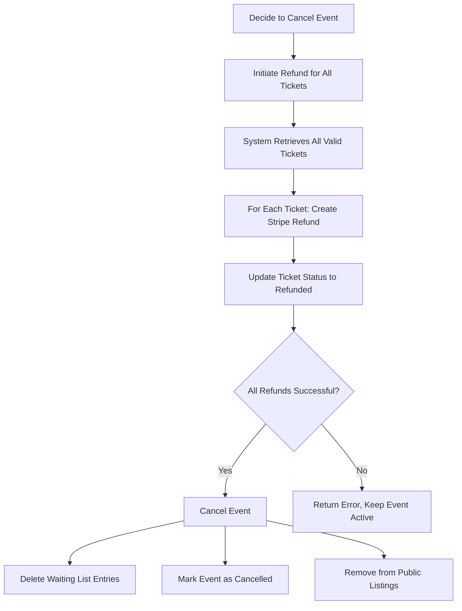
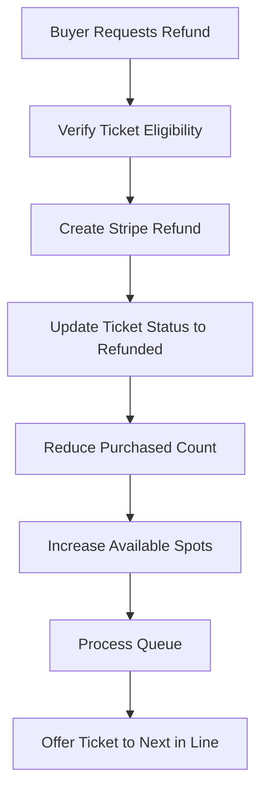

Learn how refunds work on Ticket Hub, when they're applicable, and how to process them for your events.

## Refund Overview

Ticket Hub supports refunds for event cancellations and other valid scenarios. Understanding the refund process helps both buyers and sellers maintain trust and transparency.

<Note>
  Refunds are primarily used when sellers need to cancel their events. Individual ticket refunds may also be available based on your event's refund policy.
</Note>

## When Refunds Apply

### Event Cancellation

Sellers must refund all tickets when:
- Cancelling an event
- Event cannot proceed as planned
- Venue becomes unavailable
- Force majeure situations

### Individual Refund Requests

Depending on your policy:
- Buyer cannot attend
- Schedule conflicts
- Within refund window
- Other valid reasons

<Warning>
  You cannot cancel an event without first refunding all ticket holders. This is enforced by the platform.
</Warning>

## Refund Conditions

### Eligible Tickets

Refunds can be processed for:

**Valid Tickets:**
- Status: `valid`
- Not yet used
- Has payment intent ID

**Used Tickets:**
- Status: `used`
- Already scanned at event
- Can still be refunded if event is cancelled

### Non-Eligible Tickets

**Already Refunded:**
- Status: `refunded`
- Cannot refund twice

**Cancelled:**
- Status: `cancelled`
- Event already cancelled

**Missing Payment Info:**
- No payment intent ID
- Cannot process refund through Stripe

## Refund Process

### For Sellers: Refunding All Tickets

When you need to cancel an event and refund all attendees:

<Steps>
  <Step title="Access Event Management">
    Navigate to your seller dashboard and select the event to cancel.
  </Step>

  <Step title="Initiate Refund Process">
    Click **Refund All Tickets** or similar action:

    The system performs several checks:
    ```typescript
    // Verification steps:
    1. Event exists
    2. You own the event (userId matches)
    3. Event has your Stripe Connect ID
    4. Valid tickets exist for refund
    ```
  </Step>

  <Step title="System Processes Refunds">
    The refund process executes automatically:

    **For each valid ticket:**

    1. **Retrieve ticket details**
       - Get payment intent ID
       - Verify ticket status
       - Check refund eligibility

    2. **Create Stripe refund**
       ```typescript
       await stripe.refunds.create(
         {
           payment_intent: ticket.paymentIntentId,
           reason: "requested_by_customer"
         },
         {
           stripeAccount: stripeConnectId  // Your account
         }
       )
       ```

    3. **Update ticket status**
       ```typescript
       // Ticket marked as refunded
       status: "refunded"
       ```

    4. **Process next ticket**
       - Continues through all tickets
       - Uses Promise.allSettled for parallel processing
       - Tracks success/failure for each

    <Info>
      Refunds are processed in parallel for efficiency, but each is tracked individually to catch any failures.
    </Info>
  </Step>

  <Step title="Verify Completion">
    After processing:

    **All successful:**
    - All tickets marked as `refunded`
    - Event can now be cancelled
    - Waiting list entries will be deleted on cancellation

    **Some failed:**
    - Error message indicates failures
    - Check logs for specific issues
    - Retry failed refunds
    - Contact support if needed

    <Warning>
      If any refunds fail, the event cannot be cancelled. You must resolve all failures first.
    </Warning>
  </Step>

  <Step title="Cancel the Event">
    Once all refunds succeed:

    The system automatically:
    - Marks event as cancelled (`is_cancelled: true`)
    - Deletes all waiting list entries
    - Removes event from public listings
    - Preserves event data for records

    ```typescript
    // Event cancellation after refunds
    await convex.mutation(api.events.cancelEvent, { eventId })
    ```
  </Step>
</Steps>

### Refund Timeline

<Steps>
  <Step title="Immediate: System Processing">
    - Refund request submitted to Stripe
    - Ticket status updated to `refunded`
    - Event metrics updated
  </Step>

  <Step title="1-2 Business Days: Stripe Processing">
    - Stripe processes the refund
    - Validates payment intent
    - Initiates return to buyer's card
  </Step>

  <Step title="3-10 Business Days: Bank Processing">
    - Buyer's bank receives refund
    - Funds appear in buyer's account
    - Timeline varies by bank and card type
  </Step>
</Steps>

## Impact on Waiting List

Refunds and cancellations affect the waiting list:

### During Refunds

**While processing refunds:**
- Waiting list remains active
- No new offers are made
- Existing offers continue to expire normally

### After Event Cancellation

**Once event is cancelled:**
```typescript
// All waiting list entries deleted
const waitingListEntries = await ctx.db
  .query("waitingList")
  .withIndex("by_event_status", (q) => q.eq("eventId", eventId))
  .collect()

for (const entry of waitingListEntries) {
  await ctx.db.delete(entry._id)
}
```

**What happens to users in queue:**
- All entries removed from database
- No further ticket offers sent
- Users notified of cancellation
- Queue positions no longer exist

### Automatic Queue Processing

If you refund individual tickets (without cancelling the event):

<Steps>
  <Step title="Ticket Refunded">
    Individual ticket status changes to `refunded`.
  </Step>

  <Step title="Capacity Opens Up">
    Available spots increase:
    ```typescript
    availableSpots = totalTickets - (purchasedCount + activeOffers)
    // purchasedCount decreases by 1
    ```
  </Step>

  <Step title="Queue Processes">
    System automatically:
    - Detects new availability
    - Offers ticket to next person in waiting list
    - Starts 30-minute countdown for new offer
    - Continues until all spots filled
  </Step>
</Steps>

<Info>
  This ensures refunded tickets don't go to waste—they're immediately offered to people waiting in line.
</Info>

## Seller Implications

### Financial Impact

**Revenue Adjustments:**
```typescript
// Before refund:
originalRevenue = soldTickets × ticketPrice × 0.99  // Minus 1% fee

// After refund:
refundedAmount = refundedTickets × ticketPrice
netRevenue = originalRevenue - refundedAmount
```

**Example:**
- 100 tickets sold at £50 each
- Original revenue: £4,950 (99% of £5,000)
- 10 tickets refunded
- Refund amount: £500
- Final revenue: £4,450

### Payout Impact

<Warning>
  Refunds are deducted from your Stripe account balance. If you don't have sufficient balance, it may create a negative balance that's deducted from future sales.
</Warning>

**Scenarios:**

**Sufficient Balance:**
```
Current Stripe balance: £1,000
Refund amount: £500
Remaining balance: £500
```

**Insufficient Balance:**
```
Current Stripe balance: £200
Refund amount: £500
Negative balance: -£300
Future sales offset: £300 held from next sales
```

### Metrics Impact

Your seller dashboard updates:

```typescript
metrics: {
  soldTickets: 90,          // Decreased from 100
  refundedTickets: 10,      // Increased from 0
  cancelledTickets: 0,
  revenue: £4,450           // Decreased from £4,950
}
```

## Buyer Experience

### Receiving a Refund

From the buyer's perspective:

<Steps>
  <Step title="Notification">
    Buyer is notified:
    - Email from Stripe (if configured)
    - Ticket status shows `refunded`
    - Event may show as `cancelled`
  </Step>

  <Step title="Refund Processing">
    Buyer sees:
    - Pending refund in their account
    - Original payment method credited
    - Timeline: 3-10 business days typical
  </Step>

  <Step title="Confirmation">
    Once complete:
    - Funds returned to card/account
    - Transaction appears in bank statement
    - Refund amount matches ticket price
  </Step>
</Steps>

### Buyer Ticket Status

**Before refund:**
```typescript
{
  status: "valid",
  purchasedAt: 1234567890,
  amount: 50,
  paymentIntentId: "pi_xxx"
}
```

**After refund:**
```typescript
{
  status: "refunded",
  purchasedAt: 1234567890,
  amount: 50,
  paymentIntentId: "pi_xxx"
}
```

## Error Handling

### Common Refund Errors

<AccordionGroup>
  <Accordion title="Payment intent not found">
    **Cause:** Missing or invalid payment intent ID
    
    **Resolution:**
    - Verify ticket has `paymentIntentId`
    - Check Stripe dashboard for payment
    - Contact support if ID exists but Stripe can't find it
  </Accordion>

  <Accordion title="Stripe Connect ID not found">
    **Cause:** Event owner hasn't set up Stripe Connect
    
    **Resolution:**
    - Complete Stripe Connect onboarding
    - Ensure account is verified
    - Retry refund after setup complete
  </Accordion>

  <Accordion title="Charge already refunded">
    **Cause:** Ticket was already refunded (possibly outside the platform)
    
    **Resolution:**
    - Update ticket status manually to `refunded`
    - Skip this ticket in refund process
    - No action needed—buyer already has refund
  </Accordion>

  <Accordion title="Insufficient funds in Stripe account">
    **Cause:** Your Stripe balance can't cover the refund
    
    **Resolution:**
    - Stripe will create negative balance
    - Future sales will offset the negative amount
    - Consider adding funds to Stripe account if needed
  </Accordion>
</AccordionGroup>

### Partial Refund Failures

If some refunds succeed and others fail:

```typescript
// System uses Promise.allSettled
const results = await Promise.allSettled(
  tickets.map(ticket => refundTicket(ticket))
)

// Check results
const allSuccessful = results.every(
  result => result.status === "fulfilled" && result.value.success
)

if (!allSuccessful) {
  // Returns error, prevents event cancellation
  throw new Error(
    "Some refunds failed. Please check the logs and try again."
  )
}
```

**What to do:**
1. Check error logs for specific failures
2. Resolve underlying issues (Stripe setup, payment intents, etc.)
3. Retry the refund process
4. Successfully refunded tickets won't be processed again
5. Only failed tickets will retry

## Best Practices

<CardGroup cols={2}>
  <Card title="Set Clear Refund Policies" icon="file-contract">
    Define your refund policy when creating events. Communicate deadlines, conditions, and process clearly.
  </Card>

  <Card title="Process Refunds Promptly" icon="clock">
    When you need to cancel, refund immediately. Delays frustrate buyers and can lead to disputes.
  </Card>

  <Card title="Communicate with Buyers" icon="comments">
    Notify ticket holders before initiating refunds. Explain the situation and expected timeline.
  </Card>

  <Card title="Monitor Stripe Balance" icon="wallet">
    Ensure sufficient balance to cover potential refunds. Negative balances can complicate future sales.
  </Card>

  <Card title="Keep Records" icon="database">
    Download transaction records from Stripe before cancelling events. Useful for accounting and taxes.
  </Card>

  <Card title="Test Refund Process" icon="flask">
    Create a test event, purchase a ticket, and process a refund to understand the flow before real events.
  </Card>
</CardGroup>

## Refund vs. Cancel Workflow

### Full Event Cancellation



### Individual Ticket Refund



## Frequently Asked Questions

<AccordionGroup>
  <Accordion title="How long do refunds take?">
    - System processing: Immediate
    - Stripe processing: 1-2 business days
    - Bank processing: 3-10 business days
    
    Total timeline: 5-12 business days typical
  </Accordion>

  <Accordion title="Can I refund just one ticket?">
    Yes, individual ticket refunds are possible. The system will automatically offer the newly available ticket to the next person in the waiting list.
  </Accordion>

  <Accordion title="What if I cancel an event with no tickets sold?">
    You can cancel immediately without processing refunds. The system only requires refunds for active (valid or used) tickets.
  </Accordion>

  <Accordion title="Do I get the platform fee back on refunds?">
    No, platform fees are non-refundable. When you refund a £100 ticket, £100 goes back to the buyer, but the £1 platform fee is not returned to you.
  </Accordion>

  <Accordion title="Can buyers request refunds directly?">
    Refund policies are set by you as the seller. Buyers may contact you to request refunds, which you then process through the platform.
  </Accordion>

  <Accordion title="What happens to used tickets when I cancel?">
    Even if tickets have been scanned (status: `used`), they must be refunded if you cancel the event. The refund process includes both valid and used tickets.
  </Accordion>
</AccordionGroup>

## Next Steps

<CardGroup cols={2}>
  <Card title="Create Events" icon="calendar" href="/guides/creating-events">
    Learn how to create successful events
  </Card>

  <Card title="Seller Guide" icon="store" href="/guides/selling-tickets">
    Complete guide to selling tickets
  </Card>
</CardGroup>